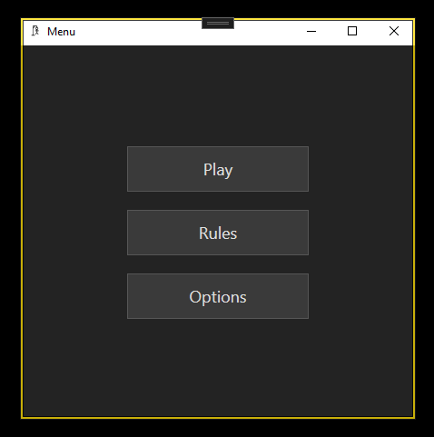
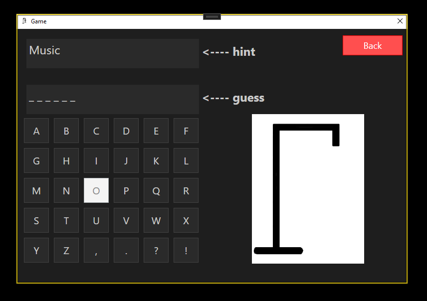
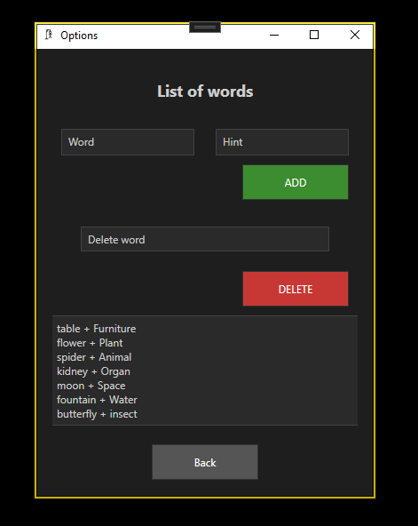

# Hangman Game

**Hangman Game** is a desktop C# WPF application that lets you play the classic Hangman. You can manage your own word list with hints, then guess letters one by one. A simple “gallows” graphic draws with each wrong guess until either you win or the man is hanged.

---

## Features

- **Custom Word List**  
  • Add words with hints.  
  • Delete unwanted entries.  
- **Hint System**  
  • Shows a category or clue for each word.  
- **Letter-by-Letter Guessing**  
  • Clickable alphabet buttons (A–Z, punctuation).  
  • Correct letters fill the blanks; wrong ones advance the hangman drawing.  
- **Win/Lose Conditions**  
  • Reveal full word on win.  
  • Show the completed hangman on loss and reveal the word.  
- **Dark-Themed WPF UI**  
  • Two screens: Options and Game.  
  • Responsive layout, clear typography, colored buttons.

---

## Interface Preview

  

  

  

---

## Technologies Used

- **Framework**: .NET Framework 4.7.2 (WPF)  
- **Language**: C#  
- **UI**: WPF XAML
- **IDE**: Visual Studio 2022  

---

## Error Handling & Validation

- Prevents adding empty or duplicate words.  
- Disables used letters during a round.  
- Safely resets the game state between rounds.

---

## Future Improvements

- **MVVM & Testability**  
  Refactor the codebase to use the MVVM pattern, separate view logic from game logic, and add unit tests for core components.

- **Play Again**  
  Add a “Play Again” button at the end of each round so users can immediately start a new word without going back to the main menu.

- **Scoring & Statistics**  
  Track wins, losses and guess counts; display a simple leaderboard or session summary.

- **Difficulty Levels**  
  Introduce Easy/Medium/Hard modes by varying word length or reducing the number of allowed wrong guesses.

